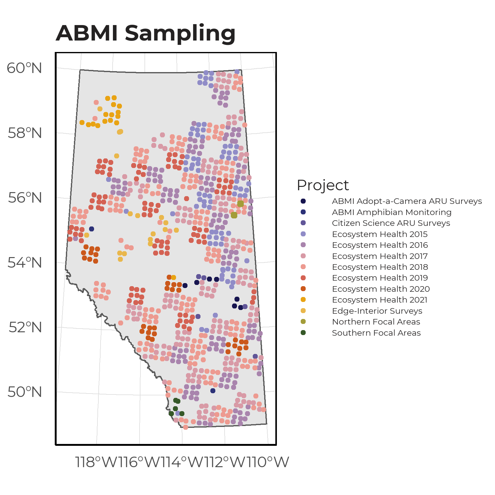
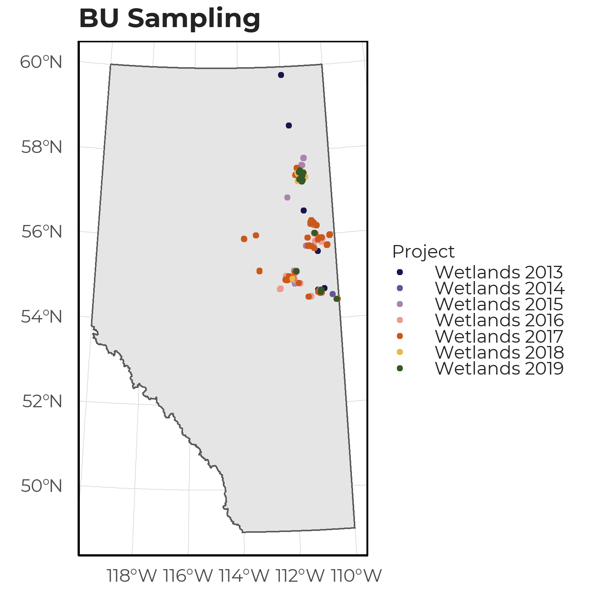

# Data Collection

## ARU Deployments

The ARU data used to construct our SDM came from two primary sources: ABMI and the Bioacoustic Unit. Surveys collected by the ABMI was done across the following projects:

- Ecosystem Health sites (2015-2021)
- Adopt-a-Camera/ARU (2017)
- Citizen Science ARU (2016)
- Edge-Interior (2017)
- Northern Focal Areas (2019-2020)
- Southern Focal Areas (2020)
- Amphibian Monitoring (2020)
- Operation Grassland (2015). 

In total, there were 3303 unique sampling events.

{width=80%} 

Surveys collected by the Bioacoustic Unit came from their Wetland survey projects (2013-2019) which collected data for 1324 unique sampling events.

{width=80%}

## Processing of vocalization events

Vocalization data was processed through the WildTrax platform (https://www.wildtrax.ca/). However, due to the differences in how ARU data was collected between projects (e.g., listening time), and the time of deployment, recordings were standardized using the following procedure: 

- Only observations detected within the first minute of a recording was used.
- Recordings with high levels of noises due to precipitation, wind conditions, or industrial and background activity were excluded permitting this metadata was available.
- To replicate the conditions of a midnight survey, we filtered for recording events between 23:30-02:30 hours. We acknowledge that this survey interval may not be optimal for all vocalizing amphibians. Therefore, the daily calling phenology of each species will be investigated once sufficient data is available.
- For all species with sufficient data (greater than 20 detections), we assessed the seasonality window of calls by aggregating the percentage of detections across ARUs by Julian calendar day. 
- Local temperature during the recording event and Julian calendar day were used to account for detection variability throughout the survey window. 

After cleaning the data, there were 14,336 unique recordings used for creating our species models.

