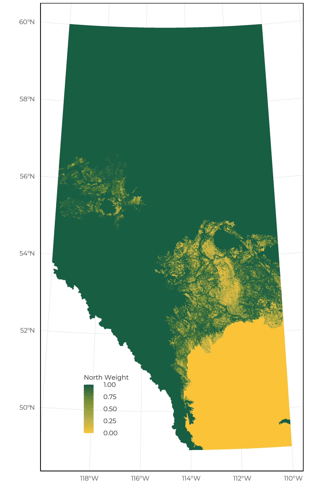

# Species Distribution Models

Depending on data availability, we construct two sets of species models. The vegetation based model (Section 4.1) is created using sites except for those in the Grassland natural region. The soil based model (Section 4.2) includes sites that fall within the Grassland and Parkland natural regions, plus the southern portion of the Dry mixedwood natural subregion. Landcover information was extracted from the ABMI detailed Wall-to-Wall vegetation and Human Footprint GIS layer [@AlbertaBiodiversityMonitoringInstitute2017]. The area of vegetation, soil, and human disturbance were determined within a 150m buffer by manual interpretation of 1:30,000 aerial photos and SPOT satellite imagery [@AlbertaBiodiversityMonitoringInstitute2016] and transformed into proportions.

## Vegetation

We classified forested vegetation into five broad stand types with age classes (0–9 years, 10–19 years, 20–39 years, 40–59 years, 60-79 years, 80-99 years, 100-119 years, 120–139 years, and +140 years): 

- **White Spruce**. This is really “upland non-pine conifer”. It is dominated by white spruce, but also includes other upland conifer species like Engelmann spruce or hybrids, balsam fir and Douglas-fir where those species occur. 
- **Pine**. Any pine species.
- **Deciduous**. Any stand type dominated by deciduous trees, primarily upland but including some areas of lowland deciduous.
- **Mixedwood**. Any stand mapped as mixedwood.
- **Black Spruce (Treed Bog)**. Lowland conifer stands, which may include species other than black spruce, but excluding stands where the dominant tree is larch.

We also define nine habitat types without age classes:

- **Treed Fen**. Lowland stands with larch present.
- **Treed Swamp**. Lowland stands with a mixture of coniferous and deciduous species.
- **Shrubby Swamp**. Shrubby wetlands that are not either fens or bogs.
- **Shrubby Bog**. Bogs dominated by shrubby vegetation.
- **Shrubby Fen**. Rich and poor shrubby fens.
- **Graminoid Fen**. Composed of grass fens.
- **Marsh**. 
- **Shrub**. Upland edaphic shrub areas. Mapping of this type is imprecise, and some early seral post-fire stands may also be included here.
- **Grass**. Upland edaphic grass areas, or herbaceous areas. Mapping of this type is imprecise, and some early seral post-fire stands may also be included here.

## Soil

Soil classes were compiled into seven broad categories:

- **Loamy**. 
- **Sandy/Loamy**. 
- **Rapid Drain**. Limy, badlands, gravel, sandhills, saline, and shallow gravel soils.
- **Clay**. Clay and sub-irrigated soils.
- **Thin Break**. 
- **Blowout**. Blowouts and saline lowland soils.
- **Other**. All other soil types with low sample sizes (e.g., lotic and lentic soil).

## Human Footprint

We classified human footprint features into 12 classes: 

- **Harvest Areas**. Contains the same age classes as natural stands (up to 80 years) and references to the time since harvest. Currently, we combine mixedwood and deciduous harvest areas.
- **Cultivation**. Cultivated cropland planted with annual crop species. Includes areas included in crop rotations.
- **Tame Pasture**. Land where soil has been disturbed and planted with perennial grass species for grazing livestock.
- **Rough Pasture**. Areas where forests and/or shrubs have been removed to allow native or introduced grass to flourish for the grazing of livestock.
- **Well sites**. Includes all active and abandoned well sites. Does not distinguish between the various types of well sites (e.g., oil, gas, bitumen, etc).
- **Rural**. Includes footprint that occurs in a rural setting but is not associated with industrial activities (e.g., country residence).
- **Urban Industrial**. These are areas intermixed with urban residential and urban industrial features in cities, towns, and villages.
- **Industrial (Rural)**. Industrial activities that predominately occur in rural settings. This can include features such as mills, oil and gas plants, and housing camps.
- **Soft Linear (Transportation)**. All vegetated verges associated with road and rail features.
- **Soft Linear (Energy)**. Pipelines and transmission lines.
- **Seismic Lines**.  Includes both narrow and wide seismic lines.
- **Hard Linear**. All road and rail hard surfaces.

## Climate

Climatic variables were derived from historical weather station data (500 m^2^ spatial resolution) using the parameter-elevation regressions on independent slopes model (PRISM) method [@Daly2002]. As amphibians require water for successful breeding, we also calculated the proportion of water within a 1 km^2^ buffer around each site. In addition, we included a term to capture the probability that an area supports trees (probability of aspen). To enable provincial wide predictions, all landcover and climate information was summarized as a 1 km^2^ raster for the entire province. 


```{r climate, echo=FALSE, tidy=FALSE}

climate.data <- data.frame(Climatic = c("Annual Heat Moisture Index", "Frost-free Period", "Monthly Reference Evaporation",
                                 "Mean Annual Precipitation", "Mean Annual Temperature", "Mean Coldest Month Temperature", 
                                 "Mean Warmest Month Temperature", "Probability of Aspen"),
                           Spatial = c("Proportion of Water", 
                                 "Latitude", "Longitude", rep("", 5)))

knitr::kable(x = list(climate.data), 
             format = "html",
             booktabs = TRUE, 
             align = "c",
             caption = 'Table of climatic information used to create the species distribution models.') %>% 
            kable_classic(full_width = F)

```


## Species models

SDMs were created for all species which were detected at a minimum of 20 ARUs within the analysis region (vegetation or soil) using a model selection framework [@AlbertaBiodiversityMonitoringInstitute2015]. We created a set of statistical models (binomial generalized linear models) to relate the relative abundance (presence/absence) of each species to two sets of variables: landcover (vegetation/soil and human footprint) and climate (climate normals and spatial location). This framework allowed us to create models for a large number of species while selecting models for each species that are only as complex as the data supports. For example, the models for a rarer species with few records may not be able to separate different age classes or even broad stand types. In these cases, all age classes or several stand types therefore have the same average value in the resulting habitat model. We assessed model fit using AUC and only present species models with at least moderate predictive ability (AUC > 0.7).

### Overlap Region

For species with both vegetation and soil based models, we weighted the predictions in regions where either model would be suitable (i.e., Parkland and Dry mixedwood). This weight is based on the probability an area supports trees (pAspen), the amount of unknown soil (pSoil), and the amount of treed areas (pFor).

<center>
$North weight = \frac{pAspen}{pAspen - (1-pFor)}$

$South weight = (1-pAspen) * (1-pSoil) * (1-pFor)$
</center>

<br>

We rescale these two weights ($North weight = \frac{North weight}{North weight + South weight}$) so that:
<br>

<center>
$South weight = North weight - 1$.


{width=80%} 

</center>

### Limitations

**The explanatory variables are confounded.** We have limited ability to separate the effects of each vegetation and human footprint type, and spatial and climate variables. In addition to the challenges generating uncertainty in the individual values, ABMI is not an experimental study. We do not design and manipulate habitat and human footprint types, and simply use what is sampled in the province. As a result, habitat and human footprint types are partially confounded with geographic location and climate variables. Our modeling separates out these effects as best as possible, but without impossible province-wide experiments, we can never be sure how well we have estimated the separate habitat, human footprint and geographic/climate effects.

**We use the same model set for all species.** Our model selection approach weights different models in a model set based on the support provided by each species’ data. However, we use the same set of models for all species. As there are only eight species of vocalizing amphibians in Alberta, we are exploring options for creating customized models for this group.

**There are errors in species identification.** Vocalization events from amphibians can be misidentified due to low volume or similarity in species calls. These errors in identifications can reduce the accuracy of our models.

**The vegetation and soil classification is simplified and contains errors.** ABMI’s vegetation map is compiled from various sources, not all of which cover the entire province. Some layers are less accurate than others. Also, even if individual polygons are accurate, their boundaries may not be precise, and many ABMI sites fall on the edges of vegetation polygons. Resulting error in the vegetation types at sites increases error in the habitat models. Some habitat types may have additional challenges. Grass and shrub sites in the North, for example, may be true permanent open habitats, but the same designation is often given to early seral stages of forested sites after fire. Grass and shrub sites in the prairies are also poorly mapped. Mixedwood stands are also poorly mapped, because they represent a gradient between deciduous and upland conifer stands, which can often change as a stand ages.

**No other effects of human activities are included in our models.** Many sites in the **Prairie** region are grazed to varying degrees but this information is not available. Thus grazing effects cannot be included in our models, and if grazing differs among native habitat types the effects confound those difference. Any wide-scale human effects, like pollution away from visible human footprint or recent climate change, are also not included in our modeling. Additionally, we only include effects of footprint at the local scale (150m) we sample at. Due to sample size constraints and confounding among variables, we do not include any additional effects that might be caused by human footprint in the larger surrounding area.

## Reporting Regions

We summarize our SDM for two reporting regions: 

- The **Forested** region is composed of the Boreal, Canadian Shield, Rocky Mountain (excluding eastern portion of the Montane subregion), and Foothills natural regions in addition to the northern portion of the Dry Mixedwood natural subregion. These areas were grouped together due to forestry being the predominate footprint type

- The **Prairie** region is composed of the Grassland and Parkland natural regions, the southern portion of the Dry Mixedwood natural subregion, and the eastern portion of the Montane natural subregion. These areas were grouped together due to agriculture being the predominate anthropogenic disturbance.

<center>
{width=80%} 

</center>
