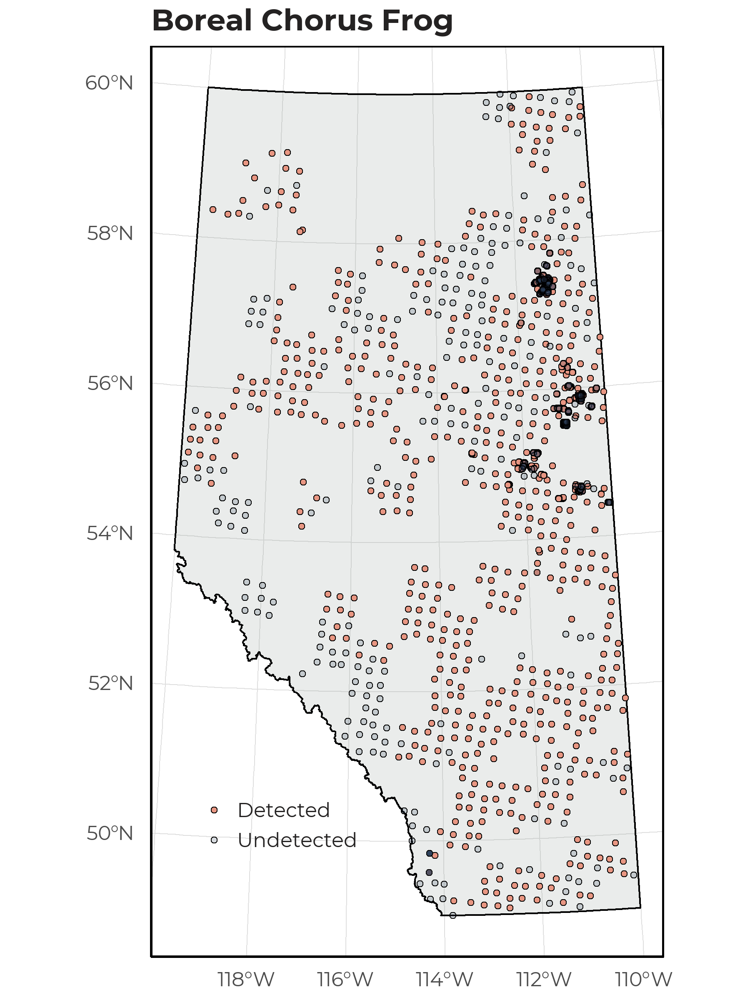
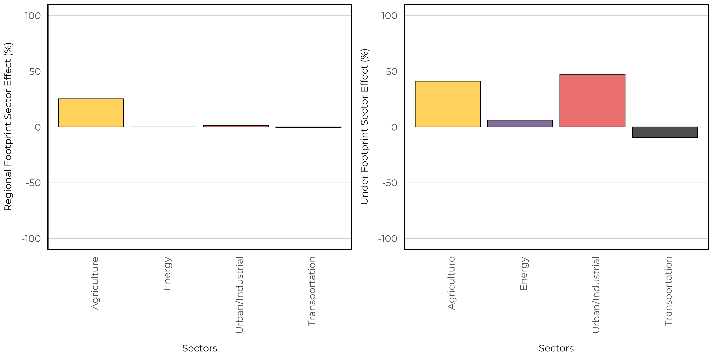

# Boreal Chorus Frog 

The Boreal Chorus Frog (*Pseudacris maculata*) is distributed throughout the entire province of Alberta, where it has been found to breed in small, shallow, wetlands with short grassy vegetation such as meadows, swamps and flooded fields (https://canadianherpetology.ca). In addition, they are also known to occupy flooded agricultural fields and small ponds in urban areas as breeding sites. This aligns with the vegetation based SDM where we predicted the species to have moderate to high abundances in both native wetland land cover and human footprint. Interestingly, we predicted high abundances of Boreal Chorus Frog in young cut-blocks. These habitats could have altered landscape properties that allow for shallow ephemeral ponds to form, thus creating attractive breeding sites. 

## Distribution

The Boreal Chorus Frog was abundant in our data set and was detected at 68.6\% of 1648 survey locations. 

{width=80%}

## Seasonality

With 4543 unique recordings of Boreal Chorus Frog, we were able to determine an optimal survey period. This species was vocalizing between early April to early July, with a peak calling frequency in mid May.

## Vegetation Models

We were able to create a SDM using the vegetation landcover information with good fit (AUC = 0.81). The vegetation based model indicated that this species is predicted to have high abundance in native wetland (bogs, fens, swamps) and open upland (grass, shrub) habitats. In addition, we predicted high abundance in crops, rough pasture, tame pasture, cut-blocks, and urban industrial footprints. 

The spatial and climate component indicated positive relationships with Mean Warm Month Temperature and a non-linear relationship with the amount of open water.

{width=60%}

## Soil Models

We were able to create a SDM using the soil landcover information with moderate fit (AUC = 0.77). The soil based models predicted similar levels of abundance in all native and human footprint landcover types. There was minimal effect between treed and non-treed sites. 

The spatial and climate component indicated positive relationships with Mean Warm Month Temperature and latitude, a non-linear relationship with the amount of open water, and a negative relationship with longitude.

{width=60%}

## Linear Features

We estimate the impacts of four types of linear features: Energy seismic lines (wide and narrow), energy soft linear (transmission lines, pipelines), hard linear (roads and rails), and transportation soft linear (road verges). We predicted the change of species relative abundance inside areas that have been disturbed by each linear feature class compared to the habitat it replaced (modeled reference condition with no human footprint). Effects less than 0% indicate habitat suitability is reduced (predicted related abundance is lower) compared to reference conditions, and values more than 0% indicate habitat suitability is improved (predicted relative abundance is higher) compared to reference conditions.

Boreal Chorus Frog was predicted to increase in all linear feature types based on the vegetation models (left). However, we observed decreased abundance in energy seismic, energy soft linear, and transportation soft linear features based on the soil models right).

{width=45%} {width=45%}

## Predicted Abundance

Under reference conditions, Boreal Chorus Frog is predicted to be moderately abundant throughout all natural regions except the Rocky Mountains (left). Under current landcover conditions (2018 footprint) we observe high abundance throughout the Grassland and Parkland natural regions (right).

{width=45%} {width=45%} 

Overall, we predicted increases in suitable habitat for Boreal Chorus Frog throughout the Parkland natural region. This is driven by our models predicting high abundance in agricultural footprint types.

{width=80%} 

## Sector Effects

Local sector effects represent the change to species relative abundance inside areas that have been disturbed by each sector (human footprint type) compared to the habitat it replaced (modeled reference condition with no human footprint). Sector effect values less than 0% indicate habitat suitability is reduced (predicted related abundance is lower) compared to reference conditions, and values more than 0% indicate habitat suitability is improved (predicted relative abundance is higher) compared to reference conditions.

Regional sector effects represent the change in the total regional population by industrial sector for species. This incorporates the area of the footprint, the native habitats where the footprint occurs, and the species response to a particular footprint. Regional population effect values less than 0% indicate a predicted decrease in the regional population due to a particular sector’s footprint, and values greater than 0% indicate a predicted increase.

### Forested Region

We predicted that Boreal Chorus Frog has local positive responses to all sectors within this region. In addition, we observe a small regional effect of agriculture. 

### Prairie Region

We predicted that Boreal Chorus Frog has local positive response to all sectors within this region. However, the responses are strongest for agriculture, forestry, and urban/industrial footprint types. In addition, we observe a moderate regional effect of agriculture. 

