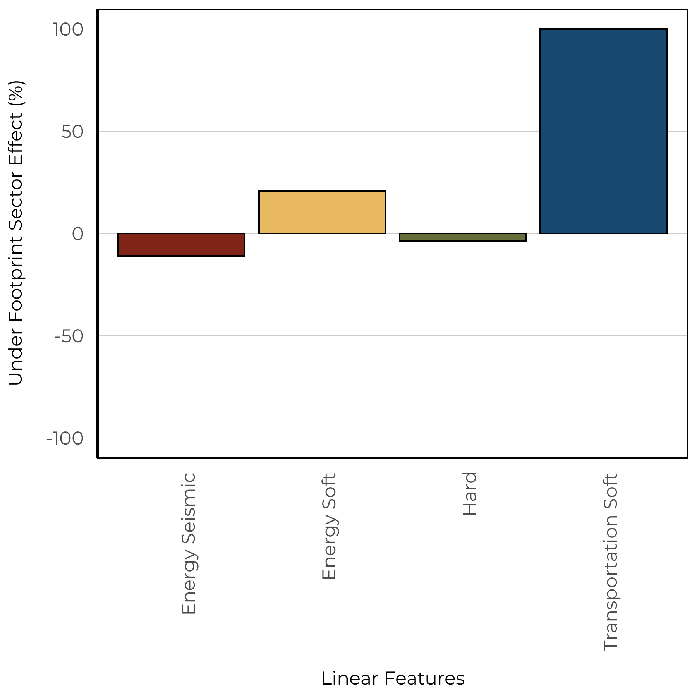
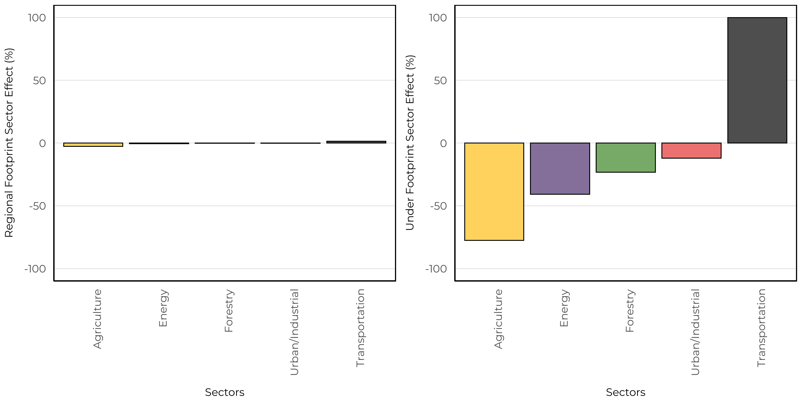
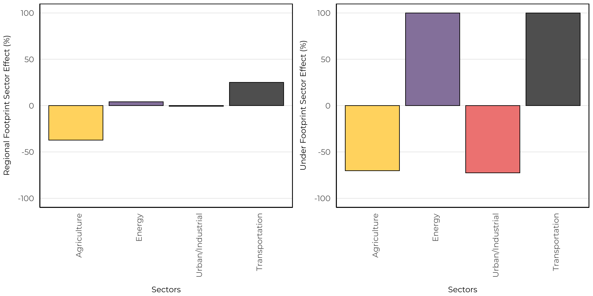

# Canadian Toad

The Canadian Toad (*Anaxyrus hemiophrys*) is distributed throughout the eastern portion of Alberta, where it breeds in wetlands, slow-flowing streams, and ditches that are located in open areas, such as prairies and aspen parkland instead of forests (https://canadianherpetology.ca). This aligns with both our vegetation and soil based models where we predicted Canadian Toad to have low abundances in human footprint features. Interestingly, we predicted high abundances of Canadian Toad in young Pine stands (e.g., Jackpine, Lodgepole pine, Limber pine). 

## Distribution

In our data set, Canadian Toad was moderately rare with detections at 16.1\% of 1648 survey locations. 

{width=80%}

## Seasonality

With 675 unique recordings of Canadian Toad, we were able to determine an optimal survey period. This species was vocalizing between early May to late July, with a peak calling frequency in mid May.

## Vegetation Models

We were able to create a SDM using the vegetation landcover information with good fit (AUC = 0.92). Our model indicated that Canadian Toad is predicted to have abundance in young pine, young bog, and shruby bog and fen native habitats. In addition, we predicted low abundance in all human footprint types except urban industrial and industrial rural types. 

The spatial and climate component indicated weak relationships except for a strong non-linear relationship with the amount of open water.

{width=60%}

## Soil Models

We were able to create a SDM using the soil landcover information with good fit (AUC = 0.86). The soil based models predicted high levels of abundance in native soil classes, and low abundance in footprint types. There was no effect between treed and non-treed sites. 

The spatial and climate component indicated positive relationships with Mean Warm Month Temperature and Mean Annual Temperature.

{width=60%}

## Linear Features

We estimate the impacts of four types of linear features: Energy seismic lines (wide and narrow), energy soft linear (transmission lines, pipelines), hard linear (roads and rails), and transportation soft linear (road verges). We predict the change to species relative abundance inside areas that have been disturbed by each linear feature class compared to the habitat it replaced (modeled reference condition with no human footprint). Effects less than 0% indicate habitat suitability is reduced (predicted related abundance is lower) compared to reference conditions, and values more than 0% indicate habitat suitability is improved (predicted relative abundance is higher) compared to reference conditions.

The vegetation based models indicate that Canadian Toad decreased in energy based linear features, while increasing in both hard and soft linear features based on transportation (left). However, the soil models indicated that Canadian Toad was predicted to increase in soft linear features, while decrease in hard linear features (right).

{width=45%} {width=45%}

## Predicted Abundance

Under both reference (left) and current (right) conditions, Canadian Toad is predicted to have moderate abundance throughout the eastern portion of Alberta.

{width=45%}{width=45%} 

We predicted decreases in suitable habitat for Canadian Toad throughout the eastern portion of the Grasslands natural region. This is driven by our models predicting low abundance in agricultural footprint types.

{width=80%} 

## Sector Effects

Local sector effects represent the change to species relative abundance inside areas that have been disturbed by each sector (human footprint type) compared to the habitat it replaced (modeled reference condition with no human footprint). Sector effect values less than 0% indicate habitat suitability is reduced (predicted related abundance is lower) compared to reference conditions, and values more than 0% indicate habitat suitability is improved (predicted relative abundance is higher) compared to reference conditions.

Regional sector effects represent the change in the total regional population by industrial sector for species. This incorporates the area of the footprint, the native habitats where the footprint occurs, and the species response to a particular footprint. Regional population effect values less than 0% indicate a predicted decrease in the regional population due to a particular sector’s footprint, and values greater than 0% indicate a predicted increase.

### Forested Region

We predicted that Canadian Toad has local negative response to agriculture, energy, forestry, and urban/industrial footprint in this region. There is a small positive response to the transportation sector. However, we only observed small changes in the regional sector effect.

### Prairie Region

We predicted that Canadian Toad has local negative response to agriculture, and urban industrial footprint in this region. There is a positive local response to the energy and transportation sectors. However, we observed a large negative response at the regional scale driven by agriculture that outweighs the positive effects of the energy and transportation sectors.

