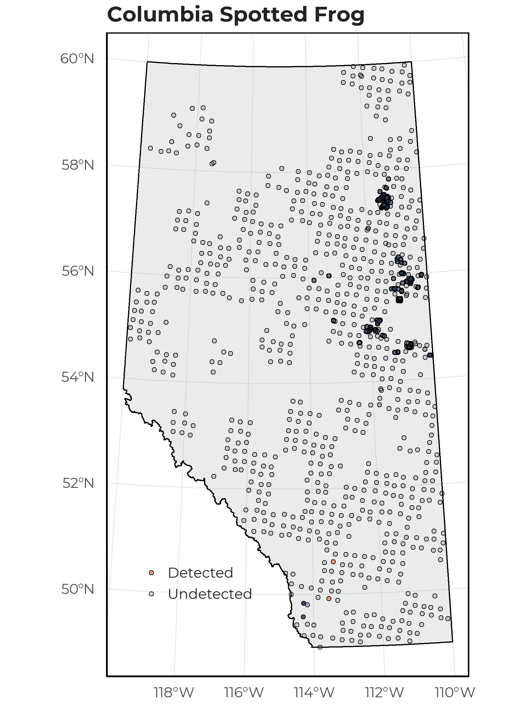
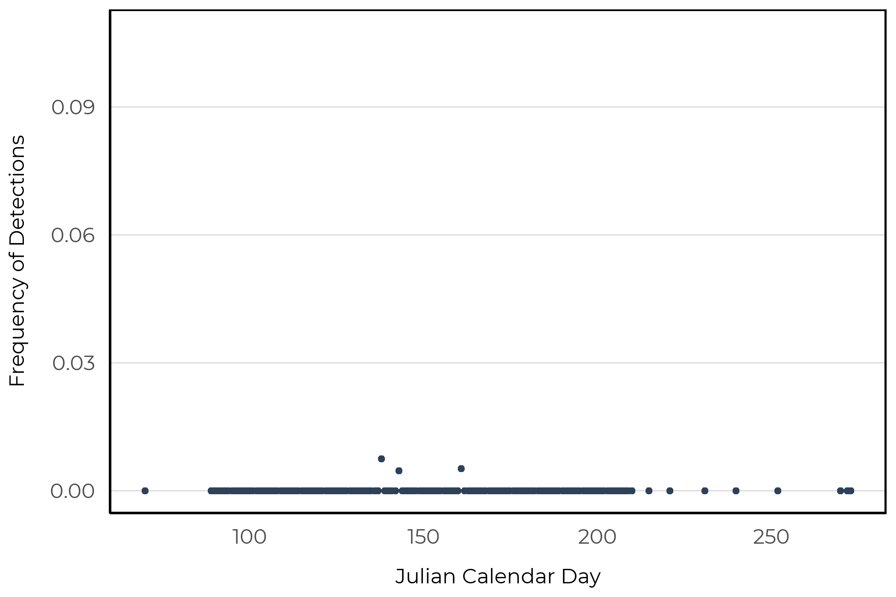

# Columbia Spotted Frog

The Columbia Spotted Frog (*Rana luteiventris*) is found throughout British Columbia and the south western portion of Alberta. This species can occur in multiple colorations (tan, shades of brown, grey, olive) but has distinct light centered dark spots on the back. Individuals occupy and breed in wetlands and other permanent aquatic habitats with shallow warm areas and emergent vegetation. They will forage in terrestrial habitats, but hibernate underwater (https://canadianherpetology.ca).

## Distribution

The Columbia Spotted Frog was rare in our data set and detected at 2 of 1648 survey locations. Both detections occurred in the south western portion of the province.

{width=80%}

## Seasonality

As we have so few detections of this species, we are unable to determine an optimal survey period based on our data alone. Of the three unique recordings collected, we observed Columbian Spotted Frog between mid May and mid June.

