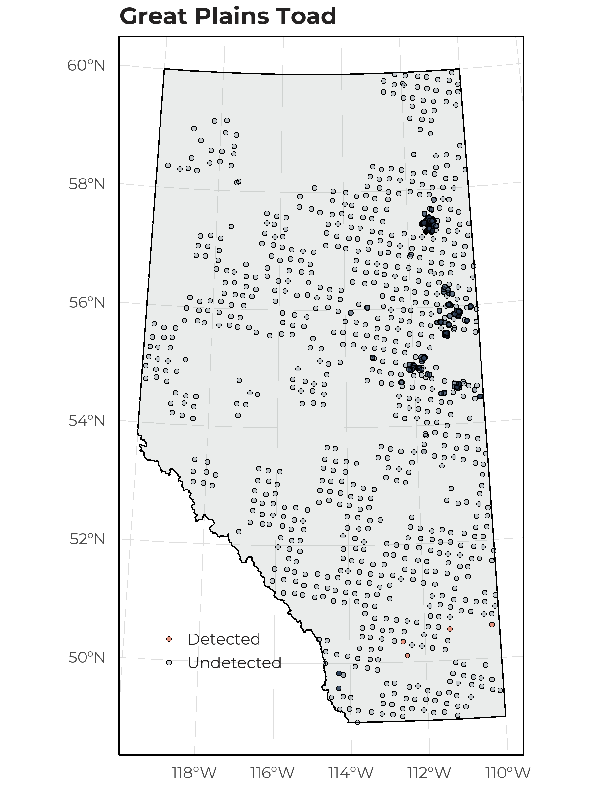
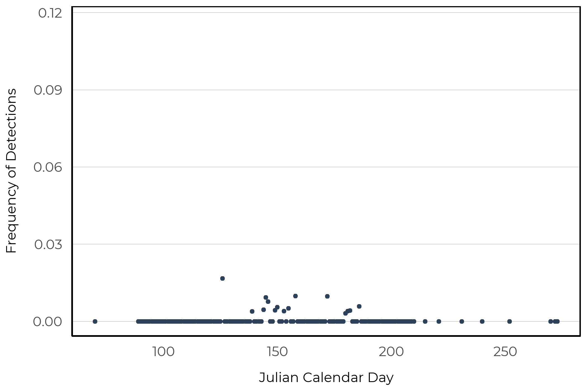

# Great Plains Toad

The Great Plains Toad (*Anaxyrus cognatus*) is found in the south eastern portion of Alberta grasslands. This toad is usually light brown or olive with dark blotches surrounding by a light border and light stripes. The Great Plains Toad is found in both shallow natural and anthropogenic water bodies (e.g., dikes, ditches), and burrows deep in the soil to avoid the dry period and hibernate (https://canadianherpetology.ca).

## Distribution

The Great Plains Toad was rare in our data set and detected at 4 of 1648 survey locations. All four detections were within the Grassland natural region of Alberta.

{width=80%}

## Seasonality

As we have so few detections of this species, we are unable to determine an optimal survey period based on our data alone. Of the nineteen unique recordings collected, we observed Great Plains Toad between late May and late June.

