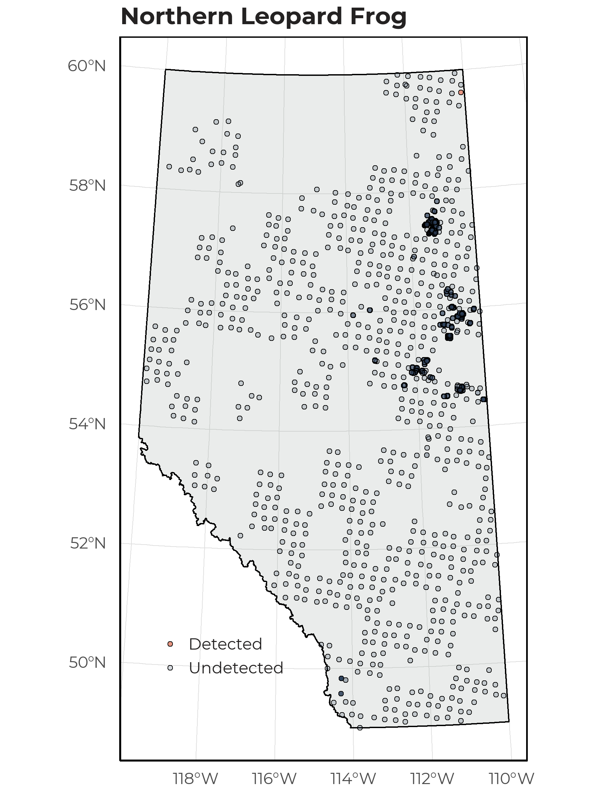
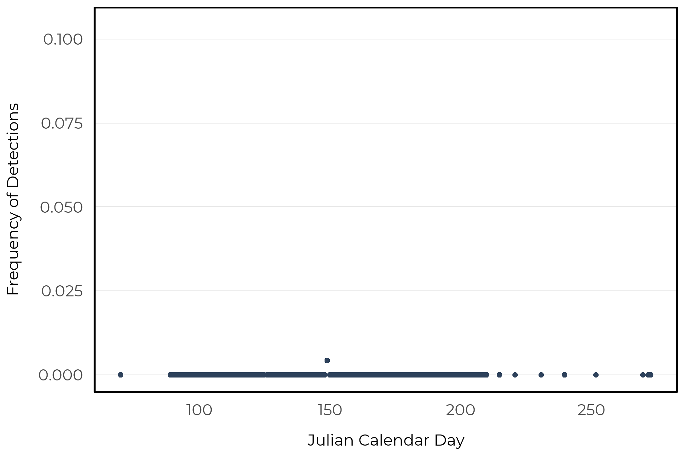

# Northern Leopard Frog

The Northern Leopard Frog (*Rana pipiens*), despite its name, occupies the eastern portion of Alberta. They are green or brown with distinct dark spots. This species occupies fish free water bodies and spends extensive time foraging in terrestrial habitats. During winter, they will hibernate at the bottom of large water bodies (https://canadianherpetology.ca).

## Distribution

The Northern Leopard Frog was rare in our data set and  detected at 1 of 1648 survey locations. This detection was observed in the Canadian Shield. 

{width=80%}

## Seasonality

With only a single recording, observed in late May, we are unable to determine an optimal survey period based on our data.

