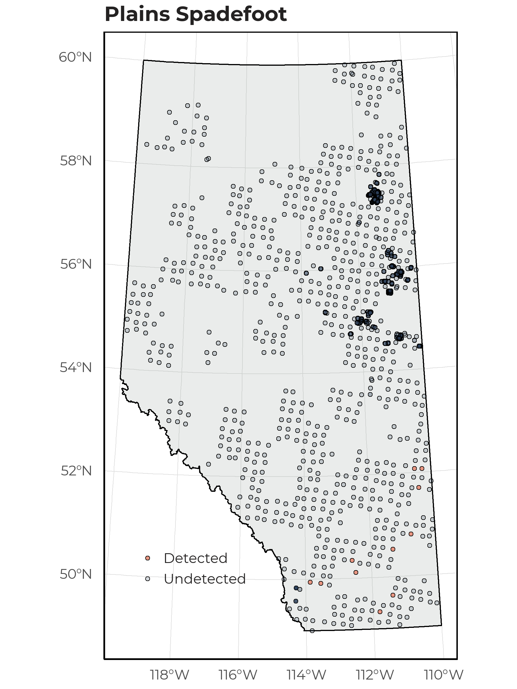
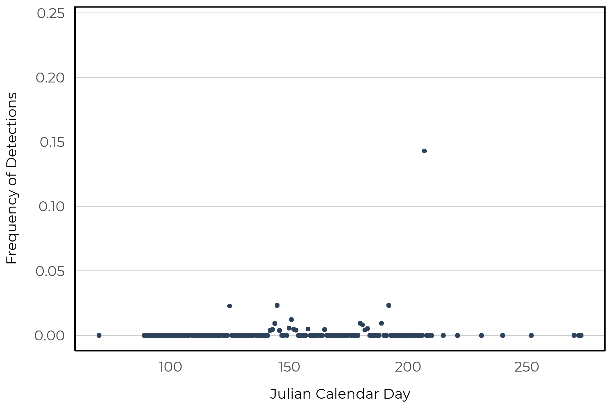

# Plains Spadefoot

The Plains Spadefoot (*Spea bombifrons*), similar to the Great Plains Toad, occurs in the southern portion of the Alberta Grasslands. They are grey, brown, or olive with reddish spots and often match their local substrate. This species occupies shallow natural and anthropogenic water bodies (e.g., temporary ponds, ditches, etc) and burrows to avoid dry conditions. They hibernate in deep burrows they dig themselves, or use unoccupied mammal burrows (https://canadianherpetology.ca).

## Distribution

The Plains Spadefoot was rare in our data set and detected at 11 of 1648 survey locations. All observations were found in the Grasslands natural region.

{width=80%}

## Seasonality

As we have so few detections of this species, we are unable to determine an optimal survey period based on our data alone. Of the twenty-nine unique recordings collected, we observed Plains Spadefoot between early May and late July.

{width=80%}

