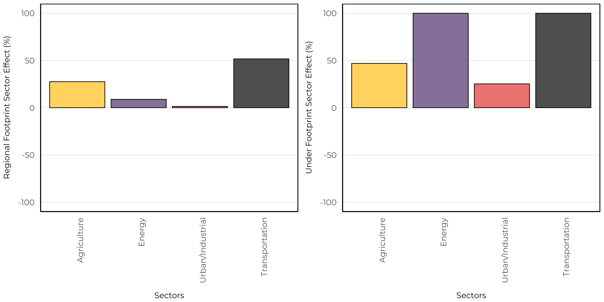

# Western Toad

The Western Toad (*Anaxyrus boreas*) is distributed throughout the western and central areas of Alberta. This species breeds in shallow aquatic habitats, such as the edges of lakes, rivers, and ponds (https://canadianherpetology.ca). Outside of the breeding period, this species occurs in a variety of wetland, forest, meadow, and scrubland habitats. This aligns with our vegetation based model, which predicted that Western Toad would have increased abundances in native wetland habitats, and low abundances in crop, tame pasture, rough pasture, and urban industrial human footprint. Similar to Boreal Chorus Frog, we observed high abundances of Western Toads in cut-blocks which could provide shallow ephemeral ponds surrounded by native vegetation that are suitable as breeding sites. However, our models are unable to identify if the high abundance in cut-blocks leads to successful breeding events or if these habitats are acting as population sinks on the landscape.

## Distribution

We found that Western Toad was relatively rare in our data set and was detected at 11.5\% of 1648 survey locations. 

{width=80%}

## Seasonality

With 324 unique recordings of Western Toad, we were able to determine an optimal survey period. This species was vocalizing between early April to late July, with a peak calling frequency in mid May.

## Vegetation Models

We were able to create a SDM using the vegetation land cover information with good fit (AUC = 0.87). The vegetation based model indicated that this species is predicted to have high abundance in native moderate aged Pine and Deciduous forests, and old Treed Bogs. This is in addition to high abundance in cut-blocks and moderate abundance in rough and tame pastures. 

The spatial and climate component indicated negative relationships with longitude and a non-linear relationship with the amount of open water.

{width=60%}

## Soil Models

We were able to create a SDM using the soil land cover information with moderate fit (AUC = 0.94). The soil based models predicted higher abundance in rapid drain, thin break, and blow out soils while low abundance for all footprint types. There was positive effect between treed and non-treed sites. 

The spatial and climate component indicated positive relationships with latitude and a negative relationship with longitude.

{width=60%}

## Linear Features

We estimate the impacts of four types of linear features: Energy seismic lines (wide and narrow), Energy soft linear (transmission lines, pipelines), Hard linear (roads and rails), Transportation soft linear (road verges). We predicted the change to species relative abundance inside areas that have been disturbed by each linear feature class compared to the habitat it replaced (modeled reference condition with no human footprint). Effects less than 0% indicate habitat suitability is reduced (predicted related abundance is lower) compared to reference conditions, and values more than 0% indicate habitat suitability is improved (predicted relative abundance is higher) compared to reference conditions.

The vegetation and soil based models indicate that Western Toad decreased in hard linear features, and increased in all other types. 

{width=45%} {width=45%}

## Predicted Abundance

Under reference conditions, Western Toad is predicted to be moderately abundant throughout the Foothills, Rocky Mountains, and west-central portions of the Boreal Natural Regions (left). Under current landcover conditions (2018 footprint) we predicted a similar distribution.

{width=45%} {width=45%} 

We predicted increases in suitable habitat for Western Toad throughout the Foothills and portions of the Boreal Natural Region. This is driven by our models predicting high abundance in forestry footprint types.

{width=80%} 

## Sector Effects

Local sector effects represent the change to species relative abundance inside areas that have been disturbed by each sector (human footprint type) compared to the habitat it replaced (modeled reference condition with no human footprint). Sector effect values less than 0% indicate habitat suitability is reduced (predicted related abundance is lower) compared to reference conditions, and values more than 0% indicate habitat suitability is improved (predicted relative abundance is higher) compared to reference conditions.

Regional sector effects represent the change in the total regional population by industrial sector for species. This incorporates the area of the footprint, the native habitats where the footprint occurs, and the species response to a particular footprint. Regional population effect values less than 0% indicate a predicted decrease in the regional population due to a particular sector’s footprint, and values greater than 0% indicate a predicted increase.

### Forested Region

We predicted that Western Toad has local positive response to the energy, forestry, and transportation sectors. In addition, we observe a small positive regional effect of the energy and forestry sectors. 

### Prairie Region

We predicted that Western Toad has local positive response to the energy, forestry, and transportation sectors. In addition, we observe a small positive regional effect of the energy and transportation sectors. 

