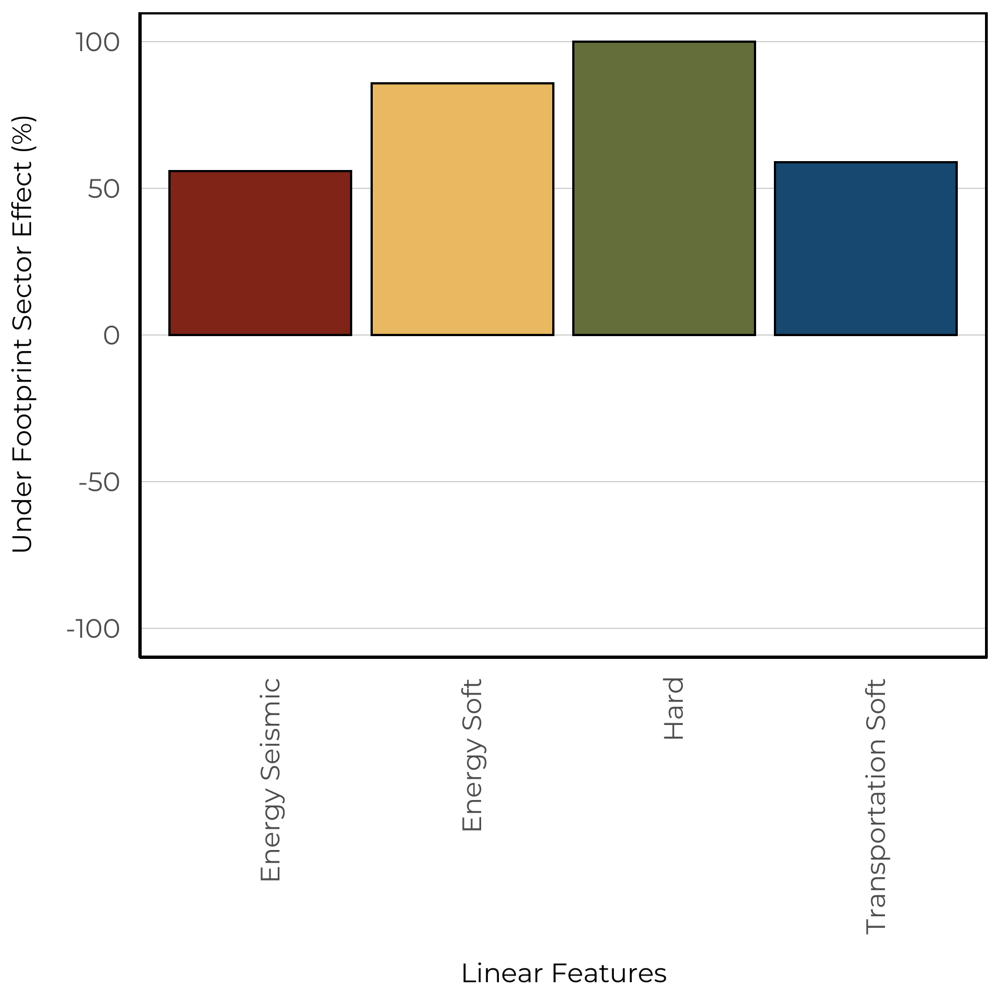
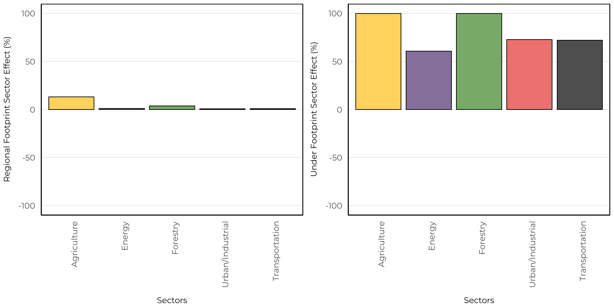

# Wood Frog

The Wood Frog (*Lithobates sylvaticus*) occupies most of Alberta, except for the southern portions of the Grassland natural region. This species is associated with deciduous and boreal forests and breeds in shallow, ephemeral wetlands, but may also breed in flooded ditches, roads, and the shallow bays of lakes (https://canadianherpetology.ca). This aligns with both our vegetation and soil based models where we predicted Wood Frog to have high abundances in human footprint features. In addition, our vegetation based models predicted increased abundances in native wetland habitats, as well as young mixedwood and intermediate deciduous forests. 

## Distribution

The Wood Frog was common in our data set and was detected at 41.9\% of 1648 survey locations.

{width=80%}

## Seasonality

Wood Frog was the second most abundant species detected With 1482 unique recordings. Using this information, we were able to determine an optimal survey period. This species was vocalizing between early April to late July, with a peak calling frequency in early May. 

## Vegetation Models

We were able to create a SDM using the vegetation landcover information with moderate fit (AUC = 0.74). The vegetation based model indicated that this species is predicted to have high abundance in native wetland (bogs, fens, swamps) and treed bog habitats in addition to high abundance in crops, rough pasture, tame pasture, harvest areas, and urban industrial footprints. 

The spatial and climate component indicated positive relationships with longitude and the amount of open water.

{width=60%}

## Soil Models

We were able to create a SDM using the soil landcover information with moderate fit (AUC = 0.82). The soil based models predicted higher abundance in loamy, sandy/loamy, and clay soil classes and high abundance in all footprint types. There was a strong positive effect between treed and non-treed sites.

The spatial and climate component indicated a negative relationship with longitude and a positive relationship with the amount of open water.

{width=60%}

## Linear Features

We estimate the impacts of four types of linear features: Energy seismic lines (wide and narrow), energy soft linear (transmission lines, pipelines), hard linear (roads and rails), and transportation soft linear (road verges). We predicted the change to species relative abundance inside areas that have been disturbed by each linear feature class compared to the habitat it replaced (modeled reference condition with no human footprint). Effects less than 0% indicate habitat suitability is reduced (predicted related abundance is lower) compared to reference conditions, and values more than 0% indicate habitat suitability is improved (predicted relative abundance is higher) compared to reference conditions.

The vegetation based models indicate that Wood Frog increased in all linear feature types (left). The soil based models also indicated the same pattern except for a slight increase in Energy Soft Linear features (right).

{width=45%} {width=45%}

## Predicted Abundance

Under reference conditions, Wood Frog is predicted to be moderately abundant throughout all natural regions except areas of the Rocky Mountains and Grasslands (left). Under current landcover conditions (2018 footprint) we observe similar abundance throughout these natural regions (right).

{width=45%} {width=45%}

We predicted increases in suitable habitat for Wood Frog throughout the Parkland natural region. This is driven by our models predicting high abundance in agricultural footprint types.

{width=80%} 

## Sector Effects

Local sector effects represent the change to species relative abundance inside areas that have been disturbed by each sector (human footprint type) compared to the habitat it replaced (modeled reference condition with no human footprint). Sector effect values less than 0% indicate habitat suitability is reduced (predicted related abundance is lower) compared to reference conditions, and values more than 0% indicate habitat suitability is improved (predicted relative abundance is higher) compared to reference conditions.

Regional sector effects represent the change in the total regional population by industrial sector for species. This incorporates the area of the footprint, the native habitats where the footprint occurs, and the species response to a particular footprint. Regional population effect values less than 0% indicate a predicted decrease in the regional population due to a particular sector’s footprint, and values greater than 0% indicate a predicted increase.

### Forested Region

We predicted that Wood Frog has local positive responses to all sectors within this region. These local responses result in a small positive effect at the regional level.

### Prairie Region

We predicted that Wood Frog has local negative responses to all sectors within this region. In addition, we observe a small regional effect of agriculture. 

